# Finesse Fitness

# About 
This is not your standard e-commerce website, it's also a community, a lifestyle and a family. Discounts and Plans are offered to all or members.

# Table of content
* [UX](#UX)
* [Features](#Features)
* [Information Architecture](#Information-Architecture)
* [Technologies Used](#Technologies-Used)
* [Testing](#Testing)
* [Deployment](#Deployment)
* [Credits](#Credits)

# UX
## Strategy Plane
The main target audience for Finesse Fitness:
  * Age 16 - 65 - this age range is ideal to help meet the users lifestyle goals
  * Users interested in their fitness and exercise
  * Users interested in improving their diets
  * Users who lack motivation to diet and exercise and need assistance
  * Users who are concerned with their physical and mental health
  * Users who are interested in purchasing fitness clothing and equipment

The user can purchase individual items on the site which make the site available for anyone who visits it. However, the main business goal is to get the user to stay by setting up a profile, subscribing and availing of the subscription's discount and benefits. This creates a friendly environment for the user to to return to and possibly purchase more products from the shop.

Research
* This is a B2C model, hence the website's use of images and lack of text (apart from the blog).
* There is a massive market for fitness products and well being, which seem to be growing every day.
* People purchasing items online are mostly impulse shopping and not many users like to register for new pages. This is why a subscription model is used to increase the number of returning users.

Features worth doing:

### Business goals
* Earn profit by allowing anyone purchase products
* Connect the business to users to access a larger audience by having social media links accessible
* Outperform competitors by providing excellent products, services, and customer support
* Provide unique designs by collaborating each month with a different artist on accessory designs
* Ensure returning users with subscription service

### User Stories

* Common user stories:
  * I want to easily navigate the site so that I can find what I'm looking for quickly.
  * I want to be able to contact the company if I'm experiencing an issue.
  * I want the website to be readable on all screen sizes.

* As a first time visitor I want to:
  * Easily understand the purpose of the site so that I can decide whether I want to invest my time into it.
  * Understand the benefits of becoming a member/registering for the site so that I can decide if I want to.
  * View and compare all memberships so that I can decide what membership if any, I want to subscribe to.
  * Easily find where I can register for the site so that I don't waste my time looking for it and I'm not discouraged not to sign up.
  * Be able to quickly register and start using the site so that I can have my account and receive the benefits
  * Check out the blog and see if the information is good and competent

* As a casual shopper I want to
  * Navigate to the shop page easily so that I can find what I need quickly.
  * Filter all products by category so that I can quickly have oversight of the products that I'm interested in.
  * Sort all items by date added, name or price so that I can identify new products, products that fit my budget, and find easier what I'm looking for.
  * Search for an item from anywhere on the site so that I can easily find what I'm looking for.
  * Be able to see the price of the item without clicking into it so that I can easily decide if I can afford the item.
  * Be able to see more details about the product so that I can make an educated decision of whether to purchase the item.
  * Select the quantity of the product so that I can choose how many products I'm purchasing and not have to add the same item multiple times.
  * See my shopping cart as items are added to know how the total without having to go to another page.
  * Edit the quantity of added items so that I don't have to remove and add items again.
  * Remove added items easily so that I can purchase only the items that I want.
  * See my shopping cart before checkout so that I can make changes before purchase.
  * See all charges included before making a payment so that I can decide if I want to proceed with the purchase.
  * View my order as I'm checking out to be able to confirm what I'm purchasing.
easily add my details without too many steps so that I don't get discouraged by the lengthy checkout process.
  * Securely add my payment information so that I feel safe giving my card details.
  * See Order confirmation.
  * Change from paid membership so that I don't have to pay for it.
  
* As a member I want to:
  * Log in and sign out quickly and easily so that I can access or close my account.
  * See my personal account information so that I can manage my details.
  * Change the membership easily so that I can control what benefits and expenses I'm having.
  * See my order history so that I can have the confirmation and details for all of them in one place and manage them easily.
  * Receive benefits as a member so that I get my money's worth.
  
* As an admin I want to:
  * Be able to add an item so that I can update the products on the site.
  * Be able to edit and remove items so that I can customize items on the site and offer new deals to customers depending on the demand and new trends.
  * Add and edit new subscriptions so that I can customize the price and benefits depending on the popularity of the subscription.
  * Add and edit new delivery types to accommodate shipping to more countries.
  * Have oversight of the user data so that if anyone is experiencing an issue I can investigate and resolve the issue.
  * Add new blog entries as needed

## Scope Plane
* Minimal Viable Product for this project is an e-commerce site with at least following features:

  * Authorization
  * Payment system
  * Product page
  * Reviews
  * Profile page

## Structure Plane
* The database structure was designed ahead of time and in described more in detail in Information Architecture section.

## Skeleton Plane
* Wireframes
  

  
Home

  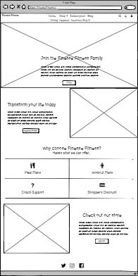
  
  
  

  

  
Shop

  
  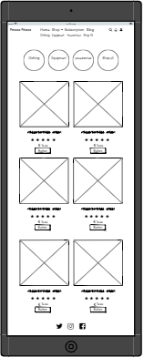
  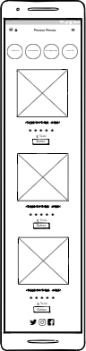
  

  

  
Product

  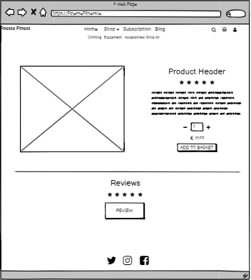
  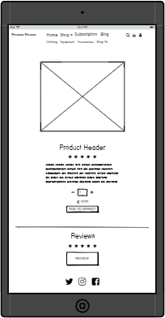
  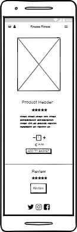
  

  

  
Subscriptions

  
  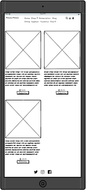
  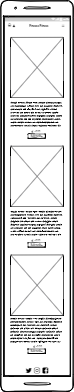
  

  

  
Shopping bag

  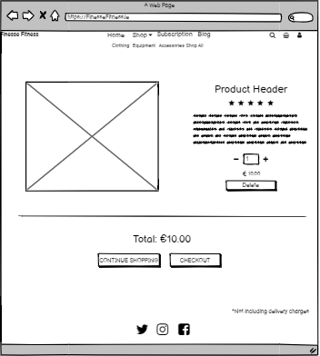
  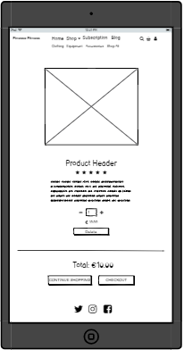
  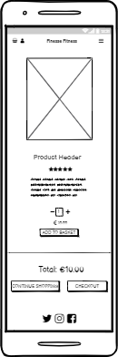
  

  

  
Checkout

  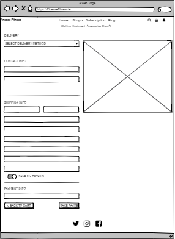
  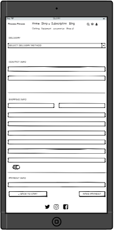
  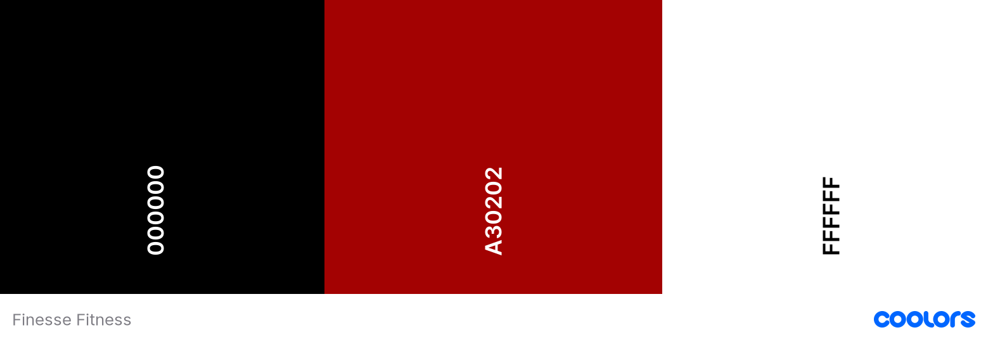
  

  

  
Order Detail

  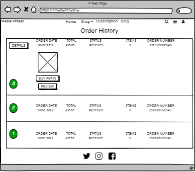
  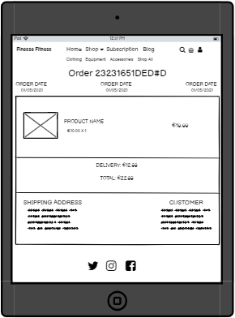
  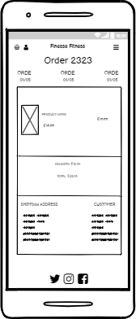
  

  
  

  
Register

  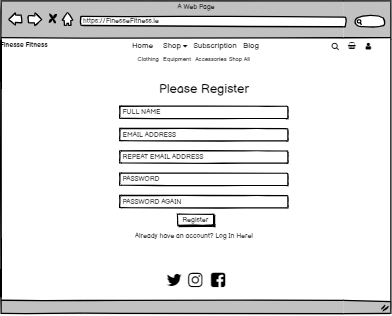
  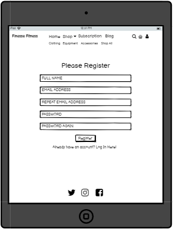
  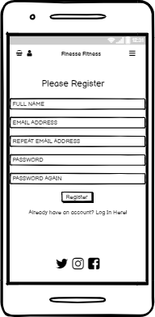
  

  

  
Log In

  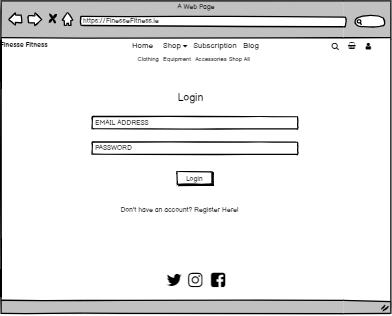
  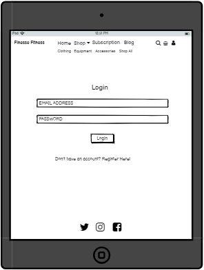
  
  

  

  
My Profile

  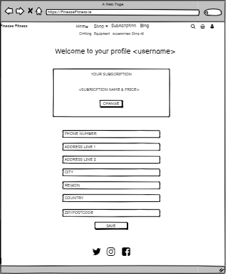
  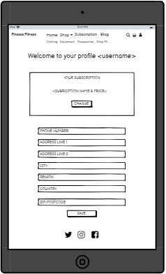
  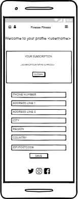
  

## Surface Plane
* Color scheme
  * The colour scheme for the website was kept quite simple, with three main colors of the site:
  

* Typography
  * This project uses one type of font:
    * Lexend Mega taken from [Google Fonts](https://fonts.google.com/)

* Imagery
  * The primary reason for using images is for informative purposes. Images are displayed in item cards to allow users to visually engage with items added by other users and decide if they are interested in the item. The secondary purpose of the images is aesthetic. The images displayed on cards are kept quite large and the same size while not being distorted. This attributes to the clean, organized look of the website. An image is also used as a hero image that takes the full screen to separate the page and not distract the user from the message on the landing page. All images have been taken from [unspalsh](https://unsplash.com/), [Lifestyle Sports](https://www.lifestylesports.com) & [Template Monster](https://www.templatemonster.com/landing-page-template/myfitness-gym-landing-page-template-100562.html)

* Other
  * All buttons have the same design of having a border in one of the primary colors and have a hover effect with background fill.
  * I used Bootstrap 5.0 as the front end framework to help with layout and easy pre-built components such as accordeons

## Features
### Existing Features
#### Common Features Across Pages
* Header - facilitates an effortless navigation across all pages
  * The header is positioned to always be visible at the top of the screen (mobile, tablet, and desktop) which allows visitors to find it quickly
  * The brand logo is positioned at the top of the page in the header and redirects the user back to the home page. This allows the user to easily find the homepage
  * The page navigation is located in the header at the top of the page on desktop and laptop sizes and collapsable top navigation for mobiles and tablets. This adheres to the navigation conventions allowing the user to intuitively navigate the page
  * Navigation links collapse in a personalized hamburger menu when viewed in mobile sizes
  * User icon is a dropdown menu displaying 'Register' and 'Log In' for the unauthorized user and 'My Profile' and 'Logout for an authorized user
* Heading
  * All headings are styled in the same manner to let the user understand the page structure quickly
*  Links/buttons
   * All links have a hover effect and are noticeably different than the rest of the text around them, indicating that they are clickable
   * All external links open in a new tab to allow the user to easily navigate back to the page
   * Buttons are outlined, with transparent background. On hover the background is filled in to match the border of the button, indicating that the button is clickable
*  Footer
   * Footer is always displayed at the bottom of the page, regardless of the content size
   * Socials are displayed and grouped. They are displayed in the footer to adhere to the convention and let the user locate them quickly
*  Messages and Bag Toast
   * A feedback is provided to the user throughout the whole page
   * The messages shown are colored to match the tone of the message - whether it's a success message or an error message.
   * Bag Toast, similarly to Messages is displayed as a pop-up and across the whole page indicated to the user what the total is and what items have been added to the cart
   * User can easily change the number of items from this cart and remove them altogether
   * User can dismiss the toast with an 'x' close button
#### Features Specific to Pages
*  Home Page
   *  Hero image with a short description and a call-to-action to let users join (register to the page)
   *  A section describing the benefits of the site with a call to action to subscribe to the page
   *  A section that shows all the benefits of joing the site
   *  A section with an image of equipment and a call-to-action to bring the users to the shop
* Shop Page
  * Items displayed in a responsive grid layout to accommodate all screen sizes
  * Only the most important information is displayed on the card such as title, rating, price, and 'Add to Bag' button. Also size and gender if applicable
  * Item image can be clicked to bring the user to the details page
  * Page has category buttons at the top so that user can easily filter all items by categories or all
  * Sort icons that can sort items by rating, price and name
*  Product Detail Page
  * Keep Shoping button that brings the user back to the previous page
  * Rating displayed
  * Description of the product which allows users to gain more information on the product
  * Quantity adder that allows the user to increase items and display price as the item quantity is changed
  * Add to the bag button that adds an item to the bag
  * A size selection box, that lets the user change the size of the product if it is applicable
* Subscriptions Page
  * User will be automatically given a free bronze subscription by default, upon registering to the site
  * All Subscriptions are displayed side by side to allow the user to compare them all and make decision
  * Subscribe button redirects a user that is not registered to the Register page
  * Change button will bring a user to the subscription checkout page
* Subscriptions Checkout
  * Displays chosen subscription it's benefits
  * User can confirm or cancel, if confirmed, their card will be charged for the amount due.
* Bag Page
  * Displays summary of items with the subtotal including the delivery.
  * Delivery Details are provided as a form using crispy forms.
  * Quantity adder that allows the user to increase items and display price as the item quantity is changed
  * User can remove item if needed with remove link
* Checkout Page
  * Order Summary is displayed on the right or small screens down the center
  * Delivery Details are provided as a form using crispy forms
  * User can save their delivery details to their profile if they have one, otherwise, they are offered sign in and sign up buttons
  * User is provided with a secure way to enter their bank details in.
* Checkout Success Page
  * Order Details are provided to the user as a confirmation on top of the e-mail that has been sent to them
* Profile Page
  * Profile Page uses crispy forms form that displays to the user any details that the user has saved. They can be edited or added to this page
  * The user's order history is shown on this page
  * User's Subscription summary is shown with the name and the price of it and the discount they get
  * 'Shop Now' button brings the user to the shop
* Blog
  * Welcomes the user to the page with their name shown at the top of the page
  * The blog entries are show in rows with the title, author, date and blog content cut off at 200 characters
  * Read more button brings the user to the blog that is selected
* Blog Detail
  * Shows the blog title, author and date and the dull blog content

#### Future Features
*  Implement stripe for subscriptions to handle yearly charges
*  One to One PT page
*  Meal plan for subcribed users
* Add Apple pay to payments and Google sign-in

## Information Architecture
  ### Database
  * The databse used for this project was [PostgresSQL](https://www.postgresql.org/) for deployed project anf [SQLite](https://www.sqlite.org/index.html) on the local machin in development

### Structure
* The data consists of 7 models accross 7 apps
  * Home app - Displays the home page of the website.
  * Checkout app - Handles the checkout pages and the checkout view for product purchase, including payments.
    * Order Model - Holds information on each order. This is populated when user completes the checkout. The details entered in the checkout will populate this model as well as custom calculations for total amount and discount and delivery charge
    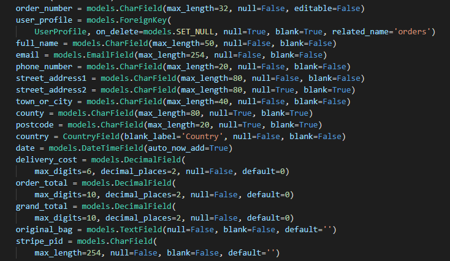
    * OrderLine Model that captures each item added to the cart and are used for calucations in the Order Model
    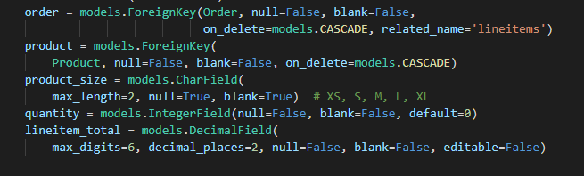
  * Subscriptions app - Displays different kinds of subscription plans, handles user subscription to subscription plans
    * SubscriptionModel - contains subscription plans
    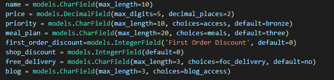
  * Products app - Handles Product Display and Individual Item Detil view
    * Category Model - Stores Item categories
    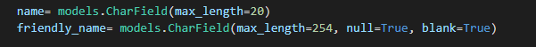
    * Product Model - stores Individual Item information
    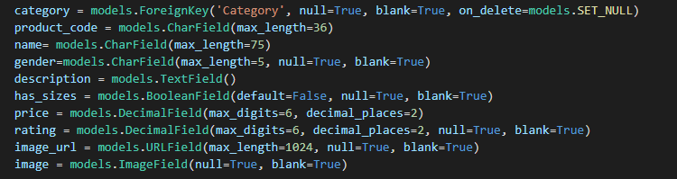
  * Profiles app - Handles Profile view and creating a profile whenever a user registers. It also handles Order History view and adds subscription as default to profile
    * Profile Model - holds data on each user.
    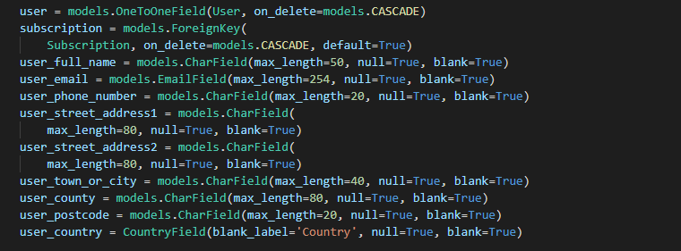
  * Blog App - Handles the blog view
    * Blog Model - holds data on the blog
    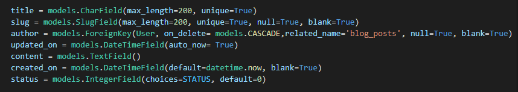

### Relationship
* The relation of the models are displayed in the image below
  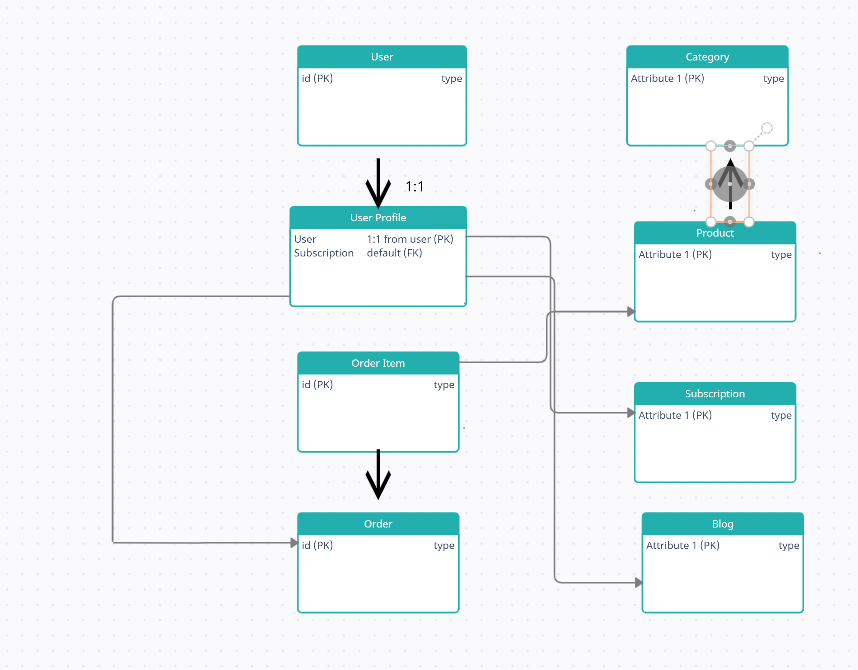
## Technologies Used
#### Languages Used
  * [HTML5](https://en.wikipedia.org/wiki/HTML5)
  * [CSS3](https://en.wikipedia.org/wiki/Cascading_Style_Sheets)
  * [JavaScript](https://www.javascript.com/)
  * [Python](https://www.python.org/)
#### Frameworks, Libraries and Programs Used
* Front-End
  * [Bootstrap 5.0](https://getbootstrap.com/) - Used for the responsive layout as well as the navigation, header, footer, forms, dropdowns, item cards, modals.
  * [Font Awesome](https://fontawesome.com/) - Font Awesome was used to add social media icons at the bottom of the page and icons
  * [Google Fonts](https://fonts.google.com/) - Google Fonts was used to import 'Montserrat' font in the style.css file.
  * [jQuery 3.5.1](https://jquery.com/) - Used in stripe javascript logic
* Back-End
 * [Django](https://www.djangoproject.com/) - used as the main framework to build the project.
 * [Stripe](https://stripe.com/) - used to facilitate single payments and subscription plans
 * [Psycopg2](https://pypi.org/project/psycopg2/) - used to allow postgresSQL to be used with python
 * [Django Crispy Forms](https://django-crispy-forms.readthedocs.io/en/latest/) - used to display forms
 * [Gunicorn](https://pypi.org/project/gunicorn/) - deployment tool
 * [Boto3](https://boto3.amazonaws.com/v1/documentation/api/latest/index.html) - aid the deployment of AWS S3
 * [Pillow](https://pillow.readthedocs.io/en/stable/) - image proccessing tool in python
 * [Whitenoise](http://whitenoise.evans.io/en/stable/) - aids static file management and serving
 * [pip3](https://pip.pypa.io/en/stable//) - used to install all packages in python
 * [SQlite3](https://www.sqlite.org/index.html) - used as a database in development
 * [PostgreSQL](https://www.postgresql.org/) - used as a database in deployment
 * [AWS S3](https://aws.amazon.com/) - used to store images and static files displayed in the deployed site
* General
  * [Git](https://git-scm.com/) - Git was used to allowing for tracking of any changes in the code and version control.
  * [Github](https://github.com/) - GitHub is used to host the project files.
  * [Visual Studio Code](https://code.visualstudio.com/) - IDE used to compile the code as well as facilitate a virtual environment.
  * [Heroku](https://dashboard.heroku.com/apps) - A cloud platform used to deploy the web application.
  * [Balsamiq](https://balsamiq.com/wireframes/desktop/#) - Used for wireframes
## Testing
All testing was documented in TESTING.md file
📊 👈 testing.md
## Deployment
#### Local
* Instructions to run the project on your local device using an IDE
  
#### Pre-requisites
* Python 3 - used to write the code and to run the project
* PIP - used to install packages
* Git - used for version control
* Visual Studio Code or any IDE of your choice - used to compile the code.
* Stripe Account

#### Recommended
* A virtual environment of your choice - used to contain all installations and packages and prevents clashing projects that might use the same package but different versions.
  * Python 3 has a built-in virtual environment venv. The commands might differ depending on your Operating System, it is advised to read the docs to ensure accuracy.
#### Steps
1. Go to the project [repository](https://github.com/Richiefinegan11/finesse_fitness)
2. Get the files used by using one of the methods below:
  * Download the files used by clicking the 'Code' button located in the top section of the repository. Then select 'Download ZIP' and unzip the files in the directory of your choice.
  * Clone the repository by running the following command from your IDE
    * 'gh repo clone Richiefinegan11/finesse_fitness'
3. In your IDE, navigate to the project directory where you located downloaded files/cloned the repo
  * 'cd path/to/your/folder
4. Activate your virtual environment. If using Python's venv:
  * 'source .venv/bin/activate'
  * on Windows where .venv is the name you gave previously
5. Install all reqauirements from requirements.txt file
  *  pip3 install -r requirements.txt
6. Create a file env.py to store environment variables
7. Add environment variable in the format as shown below:
  * os.environ.setdefault('SECRET_KEY', '<your-variable-goes-here>')
 os.environ.setdefault('DEVELOPMENT', '1')
 os.environ.setdefault('ALLOWED_HOSTS', '<your-variable-goes-here>')
 os.environ.setdefault('STRIPE_PUBLIC_KEY', '<your-variable-goes-here>')
 os.environ.setdefault('STRIPE_SECRET_KEY', '<your-variable-goes-here>')
 os.environ.setdefault('STRIPE_WH_SECRET_CH', '<your-variable-goes-here>')
 os.environ.setdefault('STRIPE_WH_SECRET_SUB', '<your-variable-goes-here>')

where

* SECRET_KEY value is a key of your choice, to ensure appropriate seccurity measures, this can be generated using Django Secret Key Generator
* DEVELOPMENT is set to 1 and is ised in settings.py logic to ensure file is dynamic between local and remote setups
* STRIPE_WH_SECRET value is obtained from the Stripe website in conjunction of using ngrok to host the server
Getting Webhooks API value
* ALLOWED_HOSTS this should be set to your ngrok url

8. Run the application
  * ' python3 manage.py runserver'
9. Website should be available on a link similar to http://127.0.0.1:8000. (check your IDE terminal)
10. Note: python3 and pip3 commands can vary depending on version/machine/IDE you're using. Always check docs if unsure.

### Remote
#### Pre-requisites
 * Set up [Heroku](www.heroku.com) Account and app
 * Create [AWS](https://aws.amazon.com/) account and upload static files used in the project

#### Steps

1. In Heroku, go to Resources and search for Heroku Postgres, we will use this as our development database
    * Select 'Hobby Dev - Free' and click to Submit Order Form
2. Comment out the 'SQLite and Postgres databases' section in the settings.py file and uncomment 'Postgres Database' section. Add your DATABASE_URL link obtained from Heroku Config Vars
    *  DATABASES = {
     'default': dj_database_url.parse('your-url-goes-here')
 }section of the repository. Then select 'Download ZIP' and unzip the files in the directory of your choice.
3. Migrate your models to Postgres SQL database
    *  python3 manage.py migrate
4. If you have a JSON file with products displayed on the site, import them now in this order
     * 'python3 manage.py loaddata categories'
     * 'python3 manage.py loaddata products'
5. Create a superuser that will be used to access the admin page as well as to manage the database. Enter username, password, and e-mail as required
     * python3 manage.py createsuperuser
6. In settings.py delete the 'Postgres SQL Database' section (make sure you don't commit your DATABASE_URL link!) and un-comment 'SQLite and Postgres SQL Databases' section - this will allow for use of either of the databases interchangeably
7. Freeze dependencies in a requirements.txt file (if it hasn't been created/updated before)
    * pip3 freeze --local > requirements.txt
8. Create a Procfile that tells Heroku to create a web dyno and add the following line in it, where the-name-of-your-app is the name of your django project
     * web: gunicorn the-name-of-your-app.wsgi:application
9. Add, commit and push your changes up to GitHub
10. Go to Heroku and add all of the following environmental variables (Settings > Reveal Config Vars)
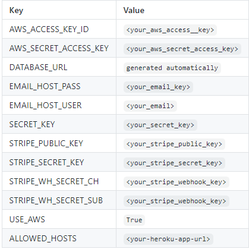
11.  In Heroku go to Deploy that's located at the top of the site

12. Click on the GitHub option and connect your GitHub account as well as your repo from GitHub (search for the repo name)
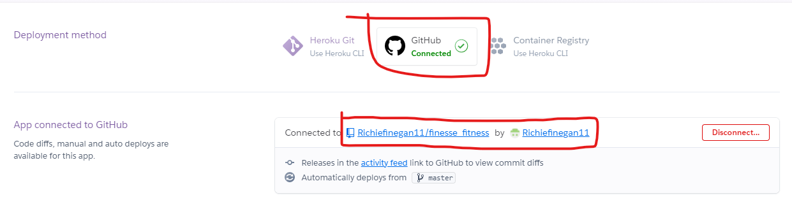
13.  Click on Enable Automatic Deploys and then Deploy Branch, you should see a successful build here
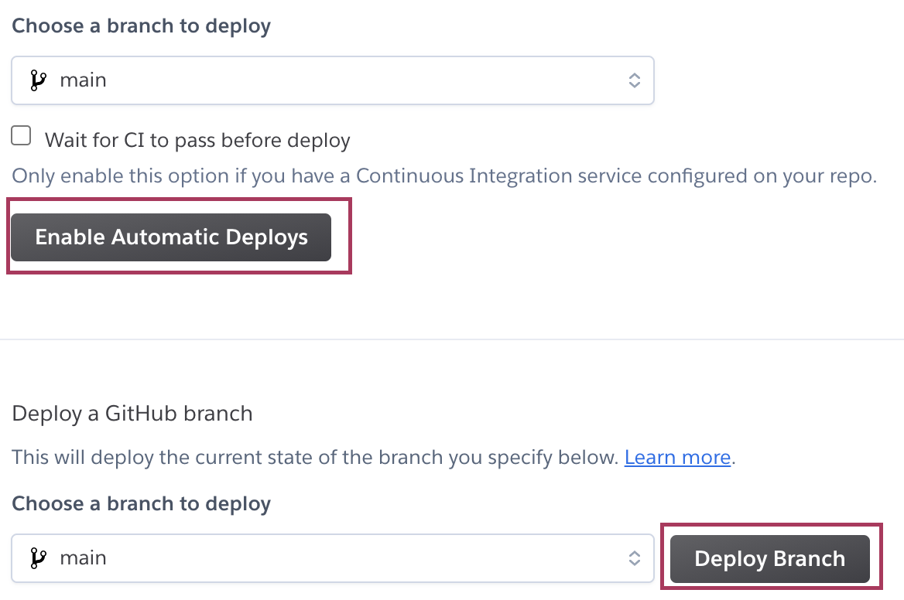
14. Open your app  

15. You should see static/ folder with your static files in it in you S3 bucket.
16. In your S3 bucket, add media/ folder.
17. If you didn't use JSON filer for product import, now is a good time to navigate to your-ulr/admin/ page and add the Products and Categories in.
18. Your app should be deployed and you should be able to see your added products.
## Credits
#### Code 💾
* Code Institue Boutique Ado

#### Media 🎬
* all images taken from unspalsh, Lifestyle Sports and Template Monster
### Acknowledgements

Big thanks to Jonathan Munz (Code Institute Mentor) - For his advice, helpful feedback, and reassurance towards the end of this project, as always.

Big thanks to the tutors who have been nothing but helpful and efficient in helping me to solve the problem that arose throughout this whole course

The Code Institute Slack Community - which was so helpful, especially for this project.

My friends and family, especially Catherine, Jordna, Aaron and Paul for their very helpful feedback for this site.

### Disclaimer
The content of this Website is for educational purposes only